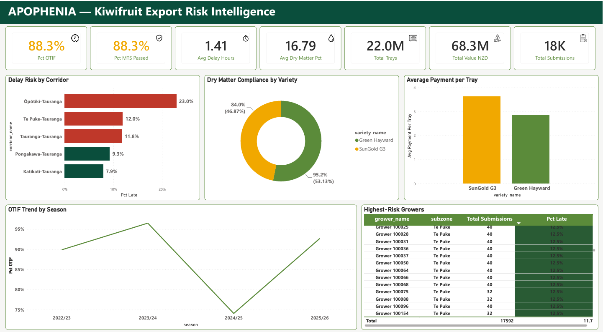

# Presentation Slides

Pitch decks and case-study presentations.

## Power BI Dashboard

- `apophenia_dashboard_v1_2026-07-28.pbix` — Power BI report file
- `apophenia_dashboard_screenshot.png` — static preview of the report

Built on top of `02_data_processed/star_schema/apophenia_star.db`, querying
`fact_pallet_submissions` joined against `dim_corridor`, `dim_variety`,
`dim_date`, and `dim_grower`. Source queries live in
`04_analysis/sql_queries/` (`q7`–`q11`).

### Report pages / visuals

- **General KPIs** — total submissions, pallets, trays, total value (NZD), average dry matter %, average delay hours, % OTIF, % MTS passed
- **Delay Risk by Corridor** — average delay hours and % late shipments per SH2 corridor, weighted against corridor distance
- **Dry Matter Compliance by Variety** — average dry matter % and % MTS pass rate per kiwifruit variety and tier
- **Average Payment per Tray** — average grower payment per tray, broken down by variety/tier
- **OTIF Trend by Season** — on-time-in-full percentage and average delay hours across season and month
- **Highest-Risk Growers** — growers ranked by lateness percentage (`RANK()` window function, minimum 15 submissions), surfacing the growers most likely to need proactive risk management
