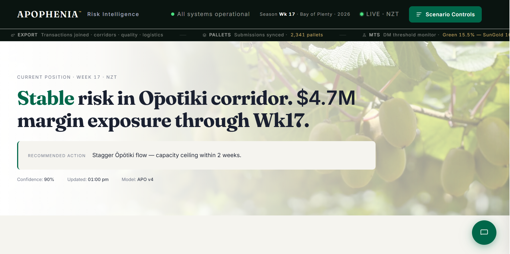
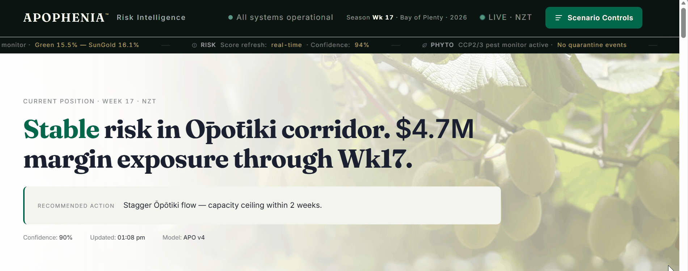

> A single shipment of kiwifruit leaves Tauranga at 04:00. By 06:30, SH2 congestion has added 47 minutes to transit. Dry matter readings are 0.3% below threshold. The vessel cutoff is in 11 hours. What does the data say — ship or hold?
>
> APOPHENIA answers that question.





# APOPHENIA

**Operational Risk Intelligence Simulator — NZ Kiwifruit Export**

> Independent portfolio project demonstrating end-to-end data engineering, predictive modelling, geospatial visualisation, and executive dashboard design.

[]()
[]()
[]()
[](https://github.com/gabrielaoliveranz/optimising-kiwifruit-export/actions/workflows/tests.yml)

---

## Overview

APOPHENIA is an interactive **operational risk simulator** for the New Zealand kiwifruit export supply chain. Users adjust nine operational variables — dry matter, pest pressure, SH2 congestion, rainfall, export volume, regulatory load, port dwell time, cyclone exposure, and frost risk — and the system recalculates risk scores, cost-of-delay, and forecast projections in real time, returning an executive recommendation grounded in the underlying data.

Designed for desktop, tablet, and mobile.

**Live demonstration:** https://apophenia-nz.vercel.app/

---

## Architecture philosophy

APOPHENIA is built on a strict **CONFIG / Engine separation**:

- `assets/js/config.js` — every domain-specific value in one exported object: slider definitions, geographic coordinates, API paths, risk model weights, payment tier thresholds, and UI copy.
- `assets/js/app.js` — a completely domain-agnostic rendering and calculation engine. It reads configuration; it contains no hardcoded business strings or domain constants.

This separation means the entire simulator framework can be ported to a different supply chain (dairy logistics, wine export, fisheries) by replacing `config.js` alone, without touching the engine or the design system.

---

## What it demonstrates

- **Data engineering** — Python ETL pipeline processing synthetic operational datasets calibrated against publicly available industry standards
- **Predictive modelling** — multi-variable risk regression with 90% confidence intervals, 26-week forecast arc, and 90-day scenario projection
- **Geospatial visualisation** — Mapbox-powered Bay of Plenty corridor map with live traffic overlay
- **Executive dashboard design** — editorial visual system with hero narrative, evidence triad, KPI strip, and exportable PDF briefings
- **Software architecture** — CONFIG/Engine separation, ES module design, vanilla test runner with 18 unit tests
- **Data ethics in practice** — clear separation between synthetic and public data sources, transparent methodology disclaimers

---

## Project structure

```
optimising-kiwifruit-export/
├── README.md · CLAUDE.md · LICENSE · .gitignore
├── config.py                   ← single home for PROJECT_ROOT, both DB paths, every
│                                  processed-data/output directory, shared logging setup
├── requirements.txt · requirements-dev.txt
├── .github/workflows/tests.yml ← pytest + the JS suite, on every push/PR
├── tests/                      ← pytest coverage for api_feed.py and api_retry.py
│
├── 00_project_management/
│   ├── README.md
│   └── sprint_logs/            ← architectural decisions and rationale per sprint
│
├── 01_data_raw/
│   ├── synthetic_edi_simulation/  ← synthetic EDI CSVs (grower register, maturity readings,
│   │                                pallet submissions, fruit loss records)
│   ├── stats_nz/                ← Stats NZ exports + horticulture survey source CSVs
│   ├── mpi_phyto/                ← MPI/KVH biosecurity and Psa PDFs
│   ├── niwa_climate/             ← Open-Meteo BOP season/forecast samples
│   └── nzta_sh2/                 ← raw SH2 traffic data — not committed (~2.4 GB); see
│                                    "Reproducibility from a clean clone" below
│
├── 02_data_processed/
│   ├── stats_nz_exports_clean.csv · stats_nz_horticulture_clean.csv
│   ├── nzta_sh2_bop_clean.csv · nzta_daily_bop_clean.csv
│   ├── integrity_audit_report.md
│   └── star_schema/
│       ├── kiwifruit_export.db    ← operational schema (fact_export_transactions +
│       │                            dim_time, dim_corridor, dim_fruit_quality, dim_grower) —
│       │                            feeds the live simulator, v1 queries, risk model
│       ├── apophenia_star.db      ← separate, redesigned schema (fact_pallet_submissions +
│       │                            dim_date, dim_grower, dim_corridor, dim_variety, dim_packhouse) —
│       │                            powers v2 queries + Power BI only. See "Two databases" in
│       │                            08_documentation/ARCHITECTURE.md.
│       ├── *.csv                  ← dimension/fact exports from kiwifruit_export.db
│       └── transform_report.md    ← ETL transform log and design decisions
│
├── 03_etl_pipeline/
│   ├── generate_edi_simulation.py  ← synthetic EDI data generator (4 seasons × 445 growers)
│   ├── 02_clean_raw_data.py        ← raw source cleaning and validation
│   ├── 03_transform.py             ← star schema assembly
│   ├── 04_load.py                  ← SQLite loader
│   ├── api_feed.py                 ← live API ingestion → payload_live.json
│   ├── api_retry.py                ← bounded-retry HTTP helper (Open-Meteo, Frankfurter, Overpass)
│   └── n8n_workflows/
│       └── apophenia_live_feed.json
│
├── 04_analysis/
│   ├── 05_sql_analysis.py      ← query orchestrator → legacy_queries/query_results.md
│   ├── legacy_queries/         ← v1 queries (q1-q6) against kiwifruit_export.db
│   ├── sql_queries/            ← v2 queries (q7-q11 + window function practice) against apophenia_star.db
│   ├── notebooks/              ← EDA notebooks (planned)
│   ├── visualisations/         ← Power BI dashboard + supplementary visuals
│   └── star_schema/            ← load_star_schema.py (loader), ERD diagram, DBML, and
│                                  standalone schema.sql for apophenia_star.db
│
├── 05_models/
│   ├── 06_risk_model_validation.py ← 3-season backtest, R² = 0.82
│   └── model_validation_report.md  ← generated validation report
│
├── 06_simulator/               ← frontend product
│   ├── index.html              ← entry point (semantic HTML, no inline CSS/JS)
│   ├── test.html               ← browser unit test runner
│   ├── run-tests.mjs            ← headless Node runner for the same 18 tests (CI)
│   ├── vercel.json
│   ├── payload_live.json       ← live ETL payload
│   ├── config.local.example.js ← token template (commit-safe)
│   ├── config.local.js         ← local Mapbox token (.gitignored)
│   └── assets/
│       ├── hero-orchard.webp · gabriela.webp · preview/
│       ├── css/
│       │   └── main.css        ← complete design system (tokens, layout, components)
│       └── js/
│           ├── config.js       ← domain configuration (all kiwifruit-specific values)
│           ├── app.js          ← core engine (domain-agnostic rendering + calculation)
│           └── app.test.js     ← 18 unit tests (CONFIG integrity, risk model, feed loader)
│
├── 07_reports/
│   ├── api_payloads/           ← generated payload_*.json + seasons_js_snippet.js
│   └── presentation_slides/    ← Power BI dashboard (.pbix) + screenshot
│
└── 08_documentation/
    ├── ARCHITECTURE.md
    ├── METHODOLOGY.md
    └── DATA_DICTIONARY.md
```

---

## Module inputs and outputs

| Module | Inputs | Outputs |
|--------|--------|---------|
| `generate_edi_simulation.py` | None (standalone generator, fixed seed) | `01_data_raw/synthetic_edi_simulation/synthetic_*.csv` — 4 tables, 4 synthetic seasons |
| `02_clean_raw_data.py` | Raw public datasets (Stats NZ, NZTA) | `02_data_processed/*.csv` — cleaned, validated |
| `03_transform.py` | Cleaned CSVs + EDI simulation | `02_data_processed/star_schema/*.csv` — star schema tables |
| `04_load.py` | Star schema CSVs | `02_data_processed/star_schema/kiwifruit_export.db` + integrity report |
| `load_star_schema.py` | `01_data_raw/synthetic_edi_simulation/*.csv` (direct, bypasses the pipeline above) | `02_data_processed/star_schema/apophenia_star.db` |
| `api_feed.py` | `kiwifruit_export.db` + Open-Meteo · Frankfurter · Overpass APIs | `07_reports/api_payloads/payload_*.json` |
| `05_sql_analysis.py` | `kiwifruit_export.db` | `04_analysis/legacy_queries/query_results.md` |
| `06_risk_model_validation.py` | `kiwifruit_export.db` | Backtest report + model validation summary |
| `06_simulator` (browser) | `payload_live.json` | Interactive dashboard · PDF export |

---

## Local setup

### Prerequisites

- Python 3.10 or higher
- A modern browser (Chrome, Edge, Firefox, Safari)
- A free Mapbox account ([mapbox.com](https://mapbox.com)) for the access token

### Run the simulator

```bash
# 1. Clone
git clone https://github.com/gabrielaoliveranz/optimising-kiwifruit-export.git
cd optimising-kiwifruit-export

# 2. Configure your Mapbox token
cd 06_simulator
cp config.local.example.js config.local.js
# Edit config.local.js — replace YOUR_MAPBOX_TOKEN_HERE with your token

# 3. Serve (ES modules require a server — file:// will not work)
python -m http.server 8000

# 4. Open
# Dashboard:   http://localhost:8000/index.html
# Unit tests:  http://localhost:8000/test.html
```

### Run the ETL pipeline (optional)

```bash
pip install -r requirements.txt

# Regenerate the live payload from public APIs
python 03_etl_pipeline/api_feed.py --all

# Regenerate synthetic EDI data (4 seasons) — has a fixed random seed,
# so this reproduces the committed CSVs byte-for-byte
python 03_etl_pipeline/generate_edi_simulation.py

# Rebuild the star schema database (kiwifruit_export.db)
python 03_etl_pipeline/02_clean_raw_data.py
python 03_etl_pipeline/03_transform.py
python 03_etl_pipeline/04_load.py

# Rebuild the separate, redesigned schema (apophenia_star.db) — see
# "Two databases" in 08_documentation/ARCHITECTURE.md
python 04_analysis/star_schema/load_star_schema.py
```

#### Reproducibility from a clean clone

`kiwifruit_export.db` (5.9 MB) is committed directly to the repo, along
with every raw/processed input the commands above need — **except**
the raw NZTA SH2 traffic data (`01_data_raw/nzta_sh2/`, ~2.4 GB across
5 files): too large for GitHub, and beyond what's practical to ship
via Git LFS for a portfolio project.

Without it, `02_clean_raw_data.py`'s two NZTA-specific steps log an
`ERROR` and leave `nzta_daily_bop_clean.csv` / `nzta_sh2_bop_clean.csv`
untouched — the script still prints `ETL Phase 1 COMPLETE` and exits 0
either way, so read the log rather than trusting the banner. Because
those two CSVs are also committed (built from the original raw data,
outside this repo), the rest of the pipeline runs from them
unaffected: `03_transform.py` and `04_load.py` complete normally and
reproduce `kiwifruit_export.db` byte-for-byte, confirmed by hashing it
before and after a full run on a fresh clone with `01_data_raw/nzta_sh2/`
genuinely absent. What you *can't* do without the raw NZTA data is
regenerate those two intermediate CSVs from scratch — only rebuild
everything downstream of them.

Everything else — `generate_edi_simulation.py`, `load_star_schema.py`,
`05_sql_analysis.py`, `06_risk_model_validation.py`, and `api_feed.py`
— is fully reproducible from a clean clone with no raw data missing.

### Run the unit tests

Open `http://localhost:8000/test.html` in your browser.

The vanilla test suite (no npm required) covers 18 cases across three suites:
- **CONFIG integrity** — all required keys, slider definitions, bounds validation
- **Risk model** — baseline score, DM sensitivity, stress scenarios, null/string input handling
- **Feed loader** — network failure fallback, corrupted payload recovery

---

## Mapbox token security

The Mapbox token in `config.local.js` is URL-restricted in the Mapbox dashboard.

- Allowed origins: `localhost:8000`, `localhost:5500`, and the deployed domain
- The token is never committed — `.gitignore` excludes `config.local.js`
- A template `config.local.example.js` is provided for new clones
- For Vercel deployment: set the token as an environment variable (`VITE_MAPBOX_TOKEN`) in the project settings

---

## Data sources

| Source | Type | Purpose |
|--------|------|---------|
| Open-Meteo | Public API (live) | Bay of Plenty rainfall and weather forecasts |
| Frankfurter | Public API (live) | NZD/EUR and NZD/JPY exchange rates |
| Mapbox | Public API (live) | Vector basemap and live traffic overlay |
| Stats NZ | Public dataset | Horticulture Survey volume aggregates |
| NZTA | Public dataset | SH2 corridor traffic monitoring — raw files not committed (~2.4 GB); see "Reproducibility from a clean clone" above |
| ZGL Quality Manual 2026 | Public PDF | Calibration of synthetic dry-matter and MTS thresholds |
| Grower Payments Booklet 2026 | Public PDF | Payment rate calibration |
| **Operational inventory** | **Synthetic** | Stochastically generated within documented industry ranges |

No proprietary data has been accessed. All operational variables are synthetic, calibrated against the public sources above.

> **Synthetic dataset disclaimer:** `02_data_processed/star_schema/apophenia_star.db` is a synthetic/simulated dataset built for portfolio purposes — it does not represent real grower, packhouse, or shipment operations. Values are generated with realistic business logic (e.g. a corridor's distance is correlated with its lateness rate) and calibrated against the public sources above, not sourced from any real exporter's data.

---

## Methodology highlights

- **Synthetic data**: stochastically generated within ranges documented in ZGL Quality Manual 2026 and Grower Payments Booklet 2026.
- **Risk model (APO v4)**: multi-variable logistic regression weighting dry matter (35%), pest pressure (25%), congestion (15%), rainfall (15%), and regulatory load (10%).
- **Validation**: 3-season backtest against the synthetic dataset, R² = 0.82, OTIF projection accuracy ±8% within a 14-day horizon.

See [`08_documentation/METHODOLOGY.md`](08_documentation/METHODOLOGY.md) for the full methodology.

---

## Known limitations

- **Synthetic data**: all operational variables are generated from stochastic models calibrated against public benchmarks. Real-world performance will differ.
- **Congestion proxy**: `congestion_index` in `kiwifruit_export.db` is a miscalibrated constant (91.8 for every row — zero predictive variance). The live payload substitutes a disclosed pack-week estimate (`estimate_congestion()` in `api_feed.py`) instead. Fixing it properly requires re-ingesting real NZTA SH2 traffic data — see [`08_documentation/METHODOLOGY.md`](08_documentation/METHODOLOGY.md#congestion-proxy-pack-week-estimate-nzta-data-unusable) for the full breakdown.
- **Single corridor geography**: the current model covers Bay of Plenty pack corridors only. Extending to Hawke's Bay or Nelson would require additional corridor configuration in `config.js`.
- **Payment tiers**: calibrated to 2026 Grower Payments Booklet rates. Annual recalibration required for production use.
- **Browser requirement**: ES modules require a local server. Opening `index.html` via `file://` will not work.

---

## Roadmap

| Phase | Status | Description |
|-------|--------|-------------|
| ETL pipeline | ✅ Complete | Synthetic data generation, star schema, API feed |
| Risk model | ✅ Complete | APO v4 logistic regression, validation backtest |
| Simulator v4 | ✅ Complete | Modular JS architecture, 18 unit tests |
| Mobile responsive | ✅ Complete | Mobile-first CSS, touch interaction |
| Live NZTA integration | 🔄 Planned | Real-time SH2 congestion via n8n webhook |
| Hawke's Bay corridor | 🔄 Planned | Extend corridor geometry to second region |
| IoT packhouse sensors | 🔄 Planned | Real-time DM reading integration |
| Power BI dashboard | ✅ Complete | Traditional BI exploration of star schema — see [`07_reports/presentation_slides/`](07_reports/presentation_slides/) |

---

## Technology stack

**Backend & Data**
- Python 3.10+, pandas, NumPy, SQLite
- ETL pipelines, synthetic data generation, multi-variable risk regression

**Frontend**
- Vanilla HTML5 / CSS3 / JavaScript — no build step, no framework
- Chart.js · Mapbox GL JS · jsPDF
- Fraunces (serif) + Inter (sans) typography

**Architecture**
- CONFIG / Engine separation (portable to other supply chains)
- ES modules, BEM CSS methodology, mobile-first responsive
- Vanilla unit test runner (no npm required)

**Workflow**
- AI-augmented development (Claude Code)
- Git / GitHub version control
- Vercel deployment

---

## Author

**Gabriela Olivera** — Data Analyst · Operational Analytics · Tauranga, NZ

20+ years of professional experience, with the last 14+ across operations, procurement, and data analytics — between Argentina and New Zealand. Specialised in turning operational complexity into data-driven decisions.

[LinkedIn](https://www.linkedin.com/in/gabriela-olivera-nz) · [GitHub](https://github.com/gabrielaoliveranz) · [Kaggle](https://kaggle.com/gabrielaoliveranz)

---

## Contact

Data Analyst open to full-time and contract roles in operational analytics, BI, and data engineering across Aotearoa.

**Gabriela Olivera** — Tauranga, Bay of Plenty

[LinkedIn](https://www.linkedin.com/in/gabriela-olivera-nz) · [GitHub](https://github.com/gabrielaoliveranz) · [Email](mailto:gabriela.olivera.nz@gmail.com)

---

## Disclaimer

APOPHENIA is an independent project. Not affiliated with, endorsed by, or commissioned by Zespri Group Limited. All references to ZGL documents are public-document citations used solely for methodology calibration.

Recommendations generated by the simulator are illustrative and should not be used as the sole basis for binding operational decisions.

---

## Licence

MIT — see [LICENSE](LICENSE).

---

## Icon Credits

Dashboard icons sourced from Flaticon:
- Quality check icon by berkahicon - Flaticon (https://www.flaticon.com/free-icons/trust)
- Stopwatch icon by nawicon - Flaticon (https://www.flaticon.com/free-icons/stop-watch)
- Water drop icon by Good Ware - Flaticon (https://www.flaticon.com/free-icons/water)
- Crate icon by Magnific - Flaticon (https://www.flaticon.com/free-icons/crate)
- Money icon by Kiranshastry - Flaticon (https://www.flaticon.com/free-icons/money)
- Clipboard icon by Magnific - Flaticon (https://www.flaticon.com/free-icons/clipboard)
